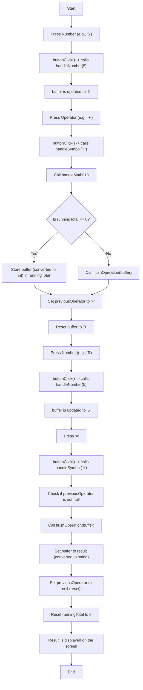

# JavaScript Exercise

## Solution

- The Solution Calculator by Brian Holt can be seen here [Click Me!](https://btholt.github.io/complete-intro-to-web-dev-v3/project-files/calculator.html)
- The solution for the HTML, CSS, and JavaScript are as follows:
  - [HTML](https://btholt.github.io/complete-intro-to-web-dev-v3/project-files/calculator.html)
  - [CSS](https://btholt.github.io/complete-intro-to-web-dev-v3/project-files/calculator.css)
  - [JavaScript](https://btholt.github.io/complete-intro-to-web-dev-v3/project-files/calculator.js)

## Logic Flowchart

